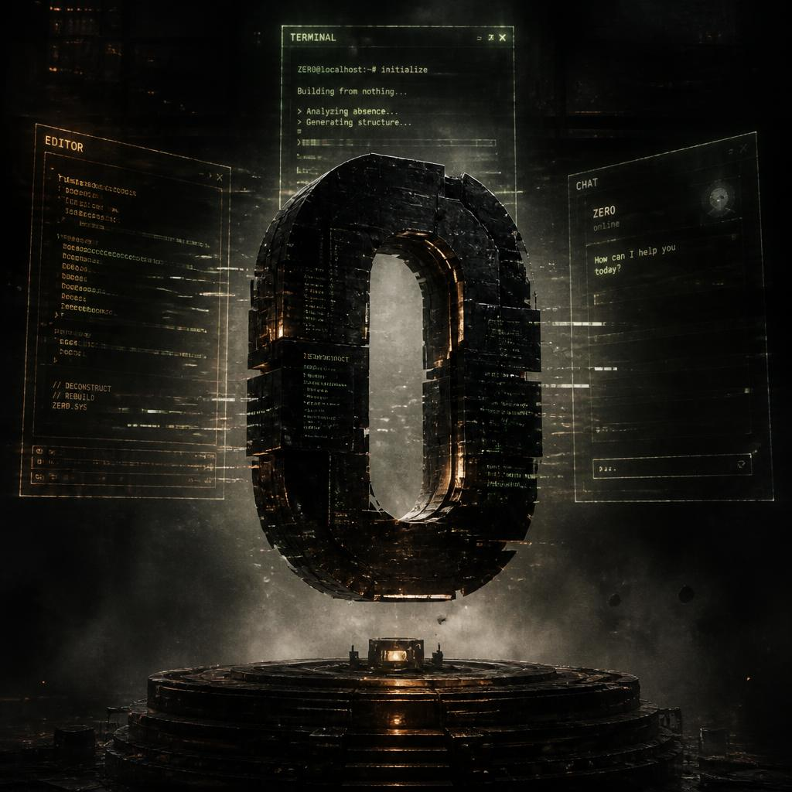
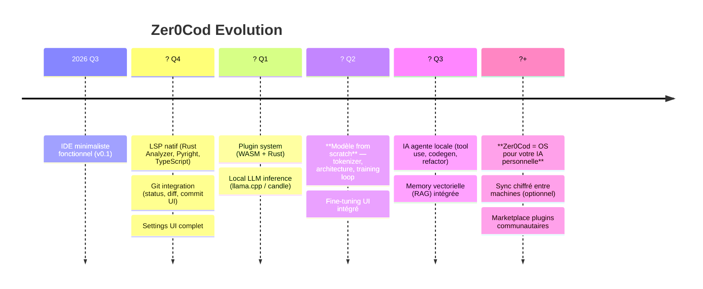
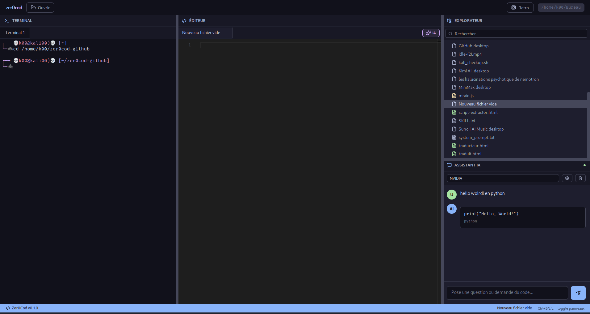
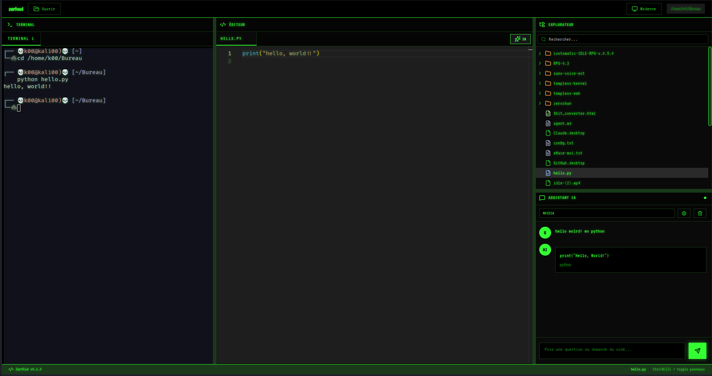
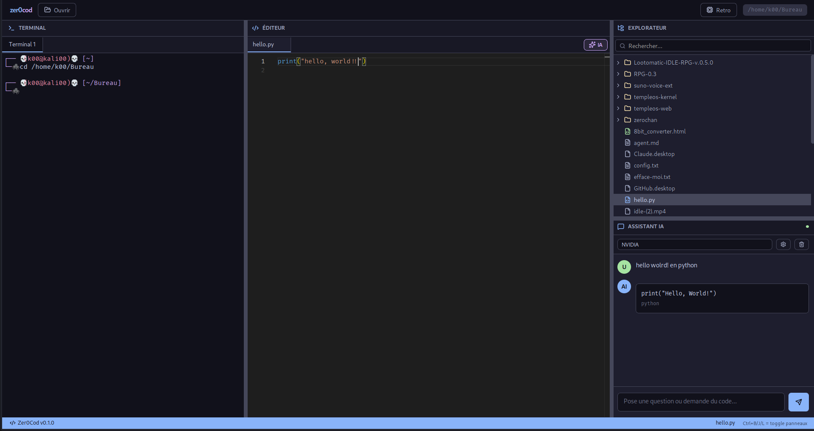

## Présentation



## ✨ Pourquoi Zer0Cod ?

La plupart des IDE sont **lourds, lents, et vous enferment** dans leur écosystème.  
Zer0Cod fait le pari inverse : **zéro surcharge, zéro télémétrie, zéro verrouillage**.

> **Ce n'est qu'un début.**  
> Cet IDE est conçu pour devenir **l'interface native de mon IA from scratch** — un modèle entraîné de zéro, sans dépendre d'API externes. Aujourd'hui, il vous donne un éditeur, un termin[...]

---

## 🚀 Fonctionnalités actuelles

| Fonctionnalité | Description |
|----------------|-------------|
| **🎨 Éditeur Monaco** | Le même moteur que VS Code — coloration, IntelliSense de base, ligatures, minimap, word-wrap |
| **💻 Terminal PTY réel** | Vrai `fork()` + `openpty()` → shell interactif (zsh/bash/fish), resize dynamique, **split horizontal** |
| **📁 Explorateur de fichiers** | Arborescence lazy-loaded, recherche floue (debounced), icons par extension |
| **🤖 Chat IA multi-providers** | OpenRouter, OpenAI, Anthropic, Google, DeepSeek, Qwen, NVIDIA, Custom (Ollama, LM Studio…) |
| **✨ Complétion IA inline** | Style Copilot dans l'éditeur (debounce 500ms, cache, toggle par onglet) |
| **🌓 Deux thèmes** | **Modern** (Catppuccin Mocha) · **Retro** (CRT vert, police VT323, text-shadow) |
| **⌨️ Raccourcis clavier** | `Ctrl+B` Explorer · `Ctrl+J` Terminal · `Ctrl+L` Chat · `Ctrl+S` Save |
| **📦 Zero config** | Tout dans `localStorage` — pas de `.json` à éditer à la main |
| **🐧 Packagé `.deb`** | Installation native Linux en un clic |

---

## 🎯 Roadmap — Vers l'IA from scratch



> **Vision finale** : Vous installez Zer0Cod → vous avez un IDE complet **ET** une IA qui comprend votre codebase, s'entraîne sur vos patterns, et tourne 100% local. Pas de cloud. Pas de compte[...]

---

## 📸 Aperçu

### Thème Modern (défaut)



### Thème Retro CRT



### Chat IA + Complétion Inline



---

## 🛠 Installation

### Linux (`.deb` — recommandé)

Option recommandée — installez la release pré-compilée (.deb) si elle existe pour votre architecture.

1) Vérifiez la page des releases et choisissez l'asset correspondant à votre architecture (amd64 / arm64) :

   https://github.com/Richerrail/Zer0cod/releases

   Astuce : vérifiez votre architecture avec :
   ```bash
   uname -m
   # x86_64 -> amd64
   # aarch64 -> arm64
   ```

2) Téléchargez l'asset (remplacez si nécessaire par le nom exact copié depuis la page des releases). Pour la release actuelle (tag `zer0cod`) les assets disponibles sont par exemple : `Zer0Cod_0.1.0_amd64.deb` (amd64) et `Zer0Cod_0.1.0_arm64.deb` (arm64).

Avec wget (exemple amd64) :
```bash
wget -O zer0cod_latest_amd64.deb "https://github.com/Richerrail/Zer0cod/releases/download/zer0cod/Zer0Cod_0.1.0_amd64.deb"
```

Avec curl (exemple amd64) :
```bash
curl -L -o zer0cod_latest_amd64.deb "https://github.com/Richerrail/Zer0cod/releases/download/zer0cod/Zer0Cod_0.1.0_amd64.deb"
```

Remarque : si vous préférez l'archive arm64, remplacez `amd64` par `arm64` dans le nom de fichier.

3) Installez le paquet (.deb) :

Méthode recommandée (apt gère les dépendances) :
```bash
sudo apt install ./zer0cod_latest_amd64.deb
```

Alternative (dpkg puis correction des dépendances) :
```bash
sudo dpkg -i zer0cod_latest_amd64.deb
sudo apt-get install -f
```

4) Lancer Zer0Cod :

```bash
# depuis le terminal
zer0cod
# ou via le lanceur d'applications (selon votre environnement de bureau)
```

Remarques:
- Si vous utilisez le dépôt upstream (k00/zer0cod) remplacez l'URL par `https://github.com/k00/zer0cod/releases`.
- Adaptez le nom de fichier (`_amd64.deb` → `_arm64.deb`) selon votre architecture.


```

### Autres plateformes
> **Windows / macOS** : Le backend PTY utilise `nix` (Linux-only).  
> Une version cross-platform arrive avec `portable-pty` (voir [#12](https://github.com/k00/zer0cod/issues/12)).  
> En attendant, vous pouvez compiler depuis les sources sur macOS (terminal simulé).

---

## ⚙️ Configuration IA

1. Ouvrez le panneau **Assistant IA** (`Ctrl+L`)
2. Choisissez un **Provider** (OpenRouter recommandé — 1 clé = 100+ modèles)
3. Collez votre **API Key**
4. Sélectionnez un **Modèle** (ex: `anthropic/claude-sonnet-4`, `gpt-4o`, `deepseek-chat`)
5. C'est prêt 🎉

**Providers supportés :**
| Provider | Base URL | Note |
|----------|----------|------|
| OpenRouter | `https://openrouter.ai/api/v1` | 🏆 Meilleur rapport qualité/prix/choix |
| OpenAI | `https://api.openai.com/v1` | GPT-4o, o1 |
| Anthropic | `https://api.anthropic.com/v1` | Via OpenRouter recommandé |
| Google | `https://generativelanguage.googleapis.com/v1beta/openai` | Gemini 2.0 |
| DeepSeek | `https://api.deepseek.com/v1` | Excellent pour code, très cheap |
| Alibaba (Qwen) | `https://dashscope-intl.aliyuncs.com/compatible-mode/v1` | Qwen 2.5 |
| NVIDIA | `https://integrate.api.nvidia.com/v1` | Nemotron, Llama 3.1 |
| **Custom** | Votre URL (Ollama, LM Studio, vLLM…) | `http://localhost:11434/v1` pour Ollama |

---

## 🏗 Architecture

```
zer0cod/
├── src/                          # Frontend React 19 + Vite
│   ├── components/
│   │   ├── Editor.jsx           # Monaco + Inline AI Completion
│   │   ├── Terminal.jsx         # xterm.js + PTY tabs/split
│   │   ├── FileExplorer.jsx     # Tree lazy + search
│   │   └── AiChat.jsx           # Multi-provider chat + history
│   ├── utils/aiCompletion.js    # Debounced completion logic
│   ├── App.jsx                  # Layout Allotment + state
│   └── App.css                  # CSS Variables theming (Modern/Retro)
│
├── src-tauri/                    # Backend Rust (Tauri 2)
│   ├── src/
│   │   ├── lib.rs               # Commands: PTY, AI Chat, Shell
│   │   └── main.rs              # Entry point
│   ├── Cargo.toml               # Deps: tauri, tokio, reqwest, nix, serde
│   └── tauri.conf.json          # Config bundle (.deb), window, CSP
│
└── package.json                  # Scripts: dev, build, tauri:*
```

### Flux IA
```
User types in Editor
       │
       ▼
debouncedCompletion(500ms)  ──►  Tauri invoke('ai_chat')
       │                              │
       ▼                              ▼
  Cache check                   Rust: reqwest → Provider API
       │                              │
       ▼                              ▼
  Return cached              Parse OpenAI-compat response
       │                              │
       └──────────► Monaco InlineCompletionsProvider ◄────────┘
```

### Terminal PTY (Linux)
```
Frontend (xterm.js)          Backend (Rust + nix)
       │                          │
       ├─ pty_create(id, shell) ──► fork() + openpty()
       │                          ├─ Thread: read(master_fd) → emit('pty-output')
       │                          │
       ├─ pty_write(data) ───────► write(master_fd)
       │                          │
       ├─ pty_resize(cols,rows) ──► ioctl(TIOCSWINSZ)
       │                          │
       └─ pty_kill() ─────────────► kill(SIGTERM) + close()
```

---

## 🎨 Personnalisation

### Thèmes
Les thèmes sont gérés par **CSS Variables** dans `src/App.css` :

```css
:root {
  --bg-primary: #1e1e2e;
  --accent: #89b4fa;
  --font-mono: 'JetBrains Mono', monospace;
  /* ... */
}

[data-theme="retro"] {
  --bg-primary: #0a0a0a;
  --text-primary: #33ff33;
  --font-mono: 'VT323', monospace;
  --radius: 0px;
  /* ... */
}
```

Ajoutez le vôtre en étendant `[data-theme="votre-theme"]` et en l'ajoutant dans `App.jsx`.

### Raccourcis
Modifiez `App.jsx` → `useEffect` clavier :
```js
case 'e': toggleExplorer(); break
case 't': toggleTerminal(); break
// ...
```

---

## 🤝 Contribuer

Zer0Cod est **ouvert aux contributions** — mais gardez à l'esprit la philosophie :

> **Minimaliste par défaut. Extensible par design.**

```bash
# 1. Fork & clone (remplacez VOTRE_USER par votre nom d'utilisateur GitHub)
git clone https://github.com/Richerrail/Zer0cod.git
cd Zer0cod

# 2. Branche feature
git checkout -b feat/ma-fonctionnalite

# 3. Installer les dépendances et coder (respectez le style: eslint + prettier)
npm install
# ou pnpm install

npm run lint
npm run format

# 4. Test build
npm run tauri:build

# 5. Ouvrez une Pull Request vers le dépôt upstream (k00/zer0cod) avec une description claire
```

**Idées bienvenues :**
- 🔌 Plugin system (WASM)
- 🧠 LSP natif (Rust Analyzer en premier)
- 🐧 `portable-pty` pour Windows/macOS
- 🔐 Secure storage (keyring) pour API keys
- 🧪 Tests (cargo test + vitest)
- 📦 CI/CD multi-platform

---

## 📄 Licence

**MIT License** — Faites ce que vous voulez, mais gardez le copyright.

Voir [LICENSE](LICENSE) pour détails.

---

## 🙏 Remerciements

| Projet | Rôle |
|--------|------|
| [Tauri](https://tauri.app/) | Framework desktop Rust + Web |
| [Monaco Editor](https://microsoft.github.io/monaco-editor/) | Moteur d'édition (VS Code) |
| [xterm.js](https://xtermjs.org/) | Terminal web |
| [Allotment](https://github.com/johnwalley/allotment) | Panneaux redimensionnables |
| [Lucide](https://lucide.dev/) | Icônes |
| [Catppuccin](https://catppuccin.com/) | Palette thème Modern |
| [VT323](://fonts.google.com/specimen/VT323) | Police thème Retro |
